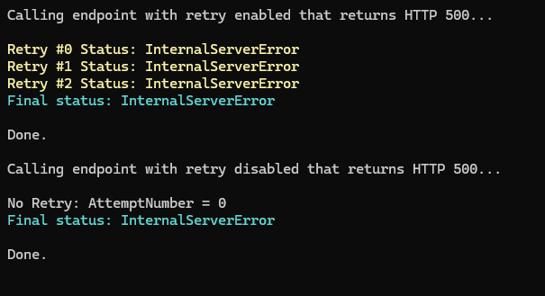

# Refit + Polly Retry using Attribute

A minimal and clean sample demonstrating how to implement **attribute-driven retry policies** using:

- ✅ Refit
- ✅ Polly (via `Microsoft.Extensions.Http.Resilience`)

This project shows how to enable retries **per endpoint** instead of applying retry policies globally — giving you fine-grained control over external API calls.

---

## Purpose

Most retry implementations apply policies globally, which can lead to unnecessary retries and reduced control over critical operations.

This sample demonstrates a modern approach where retries are only executed when explicitly declared via an attribute.

Example:

```csharp
[Get("/status/500")]
[Retry]
Task<HttpResponseMessage> Get500WithRetry();

[Get("/status/500")]
Task<HttpResponseMessage> Get500();
```

## Output



## Extending Resilience with Polly

The same attribute-driven approach used for retries can also be applied to other resilience strategies supported by Polly.

For example, you can implement a **Circuit Breaker** by adding it to the resilience pipeline and checking for a custom attribute — following the exact same logic used for `[Retry]`.

```csharp
builder.AddCircuitBreaker(new HttpCircuitBreakerStrategyOptions
{
    FailureRatio = 0.5,
    SamplingDuration = TimeSpan.FromSeconds(10),
    MinimumThroughput = 8,
    BreakDuration = TimeSpan.FromSeconds(30)
});
```

Then, create a `[CircuitBreaker]` attribute and inspect the Refit RestMethodInfo inside ShouldHandle to decide whether the strategy should be applied to the called endpoint.
